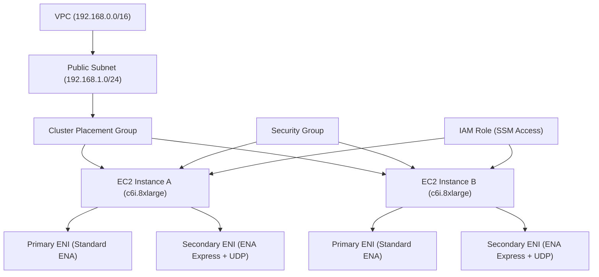
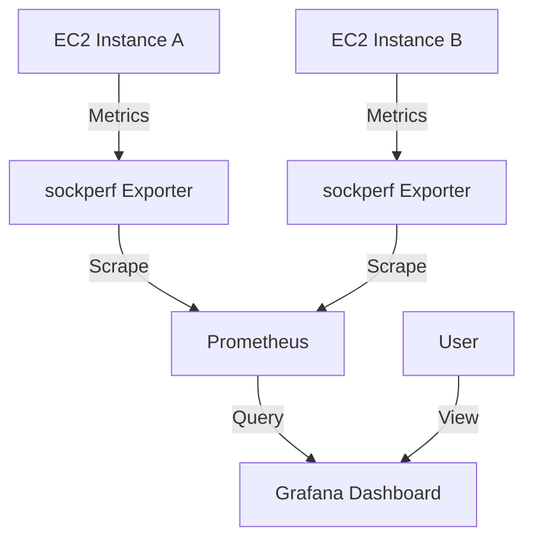

# ENA vs ENA Express Latency Performance Test Guide

## Table of Contents
- [Infrastructure Overview](#infrastructure-overview)
- [Understanding ENA and ENA Express](#understanding-ena-and-ena-express)
- [Infrastructure Setup](#infrastructure-setup)
- [Testing Methodology](#testing-methodology)
- [Analyzing Results](#analyzing-results)
- [Troubleshooting](#troubleshooting)
- [Cleanup](#cleanup)

## Infrastructure Overview

This guide outlines a test environment for comparing network latency performance between standard Elastic Network Adapter (ENA) and ENA Express on Amazon EC2 instances. The infrastructure consists of:



- **VPC and Networking**: A dedicated VPC with a public subnet for test isolation
- **Compute Resources**: Two identical c6i.8xlarge instances in a cluster placement group
- **Network Interfaces**: Each instance has two ENIs - one standard and one with ENA Express enabled
- **Security**: Custom security group allowing traffic between instances and SSH access
- **Access Management**: IAM roles for Systems Manager access

## Understanding ENA and ENA Express

### Standard ENA
Elastic Network Adapter (ENA) is AWS's standard networking interface for EC2 instances, providing:
- Up to 100 Gbps of network bandwidth
- Traditional TCP/IP networking stack
- Standard network latency characteristics

### ENA Express
ENA Express is an enhancement that leverages the AWS Scalable Reliable Datagram (SRD) technology to:
- Reduce network latency by up to 60%
- Lower tail latency (p99.9) by up to 85%
- Improve throughput for latency-sensitive applications
- Provide UDP support for applications requiring unreliable but fast datagram delivery

ENA Express is particularly beneficial for:
- High-performance computing (HPC)
- Real-time analytics
- Gaming servers
- Financial trading applications
- Any application where consistent low latency is critical

## Infrastructure Setup

Our infrastructure is deployed using Pulumi with TypeScript, consisting of:

### Networking Components
- VPC with CIDR block 192.168.0.0/16
- Public subnet with CIDR block 192.168.1.0/24
- Internet Gateway for public internet access

### Compute Resources
- Cluster placement group for low-latency networking between instances
- Two c6i.8xlarge EC2 instances running Amazon Linux 2023
- SSH access using existing key pair (keypair-sandbox0-sin-mymac.pem)

### Security Configuration
- Security group with the following rules:
  - Inbound: All traffic from the security group itself + SSH (port 22) from 0.0.0.0/0
  - Outbound: All traffic to the security group itself + all traffic to 0.0.0.0/0

### Network Interface Configuration
- Primary ENI: Standard ENA configuration
- Secondary ENI: ENA Express and ENA Express UDP enabled (configured directly during deployment)

### Access Management
- IAM role with Systems Manager access for remote management

### Pulumi Implementation

The project uses Pulumi with TypeScript, which offers several advantages:

#### Key Advantages of Pulumi Implementation

1. **Direct ENA Express Support**: Pulumi directly supports enabling ENA Express on network interfaces, eliminating the need for post-deployment AWS CLI commands.

2. **Modular Architecture**: The infrastructure is organized into reusable components (networking, compute, monitoring) following Pulumi best practices.

3. **Type Safety**: Full TypeScript support with proper typing for better code quality and IDE assistance.

4. **Simplified Configuration**: Easy configuration management through Pulumi's built-in config system.

#### Project Structure

```
pulumi/
├── Pulumi.yaml           # Project configuration
├── Pulumi.dev.yaml       # Dev stack configuration
├── package.json          # Node.js dependencies
├── tsconfig.json         # TypeScript configuration
└── src/
    ├── index.ts          # Main entry point
    ├── config.ts         # Configuration handling
    ├── networking.ts     # VPC, subnet, security group
    ├── compute.ts        # EC2 instances, ENIs with ENA Express
    └── monitoring.ts     # Prometheus and Grafana monitoring
```

#### Deployment Steps

1. Install Pulumi CLI if you haven't already:
   ```bash
   curl -fsSL https://get.pulumi.com | sh
   ```

2. Install dependencies:
   ```bash
   npm install
   ```

3. Configure AWS credentials:
   ```bash
   aws configure
   # or
   export AWS_ACCESS_KEY_ID=<your-access-key>
   export AWS_SECRET_ACCESS_KEY=<your-secret-key>
   ```

4. Deploy the stack using the deployment script:
   ```bash
   ./deploy.sh <account-id> <region> [options]
   ```

   Options:
   - `--with-monitoring`: Deploy the monitoring infrastructure
   - `--stack <name>`: Use a specific stack name (default: dev)

   Example:
   ```bash
   ./deploy.sh 123456789012 us-east-1 --with-monitoring
   ```

5. Note the outputs from the deployment, which include:
   - VPC ID
   - Security Group ID
   - Placement Group ID
   - Instance IDs and Public IPs
   - ENI IDs (with ENA Express already enabled)

6. Make the testing scripts executable:
   ```bash
   chmod +x scripts/install-test-tools.sh scripts/run-performance-tests.sh
   ```

7. Transfer the scripts to your EC2 instances using SCP or AWS Systems Manager:
   ```bash
   # Example using SCP
   scp -i /path/to/keypair-sandbox0-sin-mymac.pem scripts/* ec2-user@[instance-ip]:/home/ec2-user/
   ```

For more details on the Pulumi implementation, see the [Pulumi README](./pulumi/README.md).

## Testing Methodology

### Prerequisites
- AWS CLI configured with appropriate permissions
- sockperf installed on both instances (for both latency and throughput testing of TCP and UDP)

### Installation of Testing Tools

Connect to your instances using SSH or Systems Manager Session Manager and install sockperf using the provided script:

```bash
# Make the script executable if not already done
chmod +x install-test-tools.sh

# Run the installation script
./install-test-tools.sh
```

The script will install sockperf, which is a comprehensive network performance measurement tool that can test both latency and throughput for TCP and UDP.

If you prefer to install sockperf manually, you can use the following commands:

```bash
# Update system packages
sudo dnf update -y

# Install dependencies for sockperf
sudo dnf install -y gcc make automake autoconf libtool wget unzip

# Download and install sockperf
wget https://github.com/Mellanox/sockperf/archive/refs/tags/3.10.zip
unzip 3.10.zip
cd sockperf-3.10
./autogen.sh
./configure
make
sudo make install
```

### Running Performance Tests

You can run the performance tests using the provided scripts or manually with sockperf commands.

#### Using the ENA Express Latency Benchmark Script

The `ena_express_latency_benchmark.sh` script is a specialized tool for comparing UDP latency performance between standard ENA and ENA Express:

```bash
# Run the benchmark script
./ena_express_latency_benchmark.sh [--debug]
```

Key features:
- Runs parallel UDP tests between standard ENA and ENA Express interfaces
- Performs multiple iterations and repeats for statistical significance
- Calculates improvement percentages between ENA and ENA Express
- Generates comprehensive summary reports with detailed metrics
- Saves all test results to a timestamped directory for later analysis
- Optional `--debug` parameter for detailed diagnostic output

The script automatically:
1. Verifies sockperf servers are running on both endpoints
2. Runs UDP ping-pong tests with configurable parameters
3. Extracts key metrics (average, p50, p99, max latency)
4. Calculates improvement percentages
5. Generates formatted summary reports

Example output:
```
======================================================
          ENA vs ENA Express Performance Summary        
========================================================
Test Date: Fri Apr 11 08:26:10 UTC 2025
Total Iterations: 10
Repeats per Iteration: 10
Total Tests: 100
========================================================
                     Connection Details                 
========================================================
Regular ENI:
  Source IP: 192.168.3.170
  Destination IP: 192.168.3.59

ENA Express:
  Source IP: 192.168.3.21
  Destination IP: 192.168.3.145
========================================================
                     UDP Results                        
========================================================
Average Latency:
  Regular ENI: 35.421 μs
  ENA Express: 51.183 μs
  Improvement: -44.50%

p50 Latency:
  Regular ENI: 34.912 μs
  ENA Express: 50.781 μs
  Improvement: -45.45%

p99 Latency:
  Regular ENI: 45.673 μs
  ENA Express: 57.892 μs
  Improvement: -26.75%

Maximum Latency:
  Regular ENI: 59.045 μs
  ENA Express: 66.776 μs
  Improvement: -13.09%
========================================================
```

#### Using the General Performance Test Script

The `run-performance-tests.sh` script automates a broader set of performance tests:

1. On the server instance (Instance B):
   ```bash
   # Make the script executable if not already done
   chmod +x run-performance-tests.sh
   
   # Start the sockperf servers for different test types
   ./run-performance-tests.sh server
   ```

2. On the client instance (Instance A):
   ```bash
   # Make the script executable if not already done
   chmod +x run-performance-tests.sh
   
   # Run tests against the standard ENA interface
   ./run-performance-tests.sh client [Instance-B-Primary-IP] ena
   
   # Run tests against the ENA Express interface
   ./run-performance-tests.sh client [Instance-B-Secondary-IP] ena-express
   
   # Or run both test sets
   ./run-performance-tests.sh client [Instance-B-IP]
   ```

The script will:
- Run all the necessary tests (TCP/UDP latency and throughput)
- Save detailed results to a timestamped directory
- Process the results to extract key metrics
- Generate a comprehensive summary report in markdown format with performance comparisons

#### Manual Test Scenarios

If you prefer to run tests manually, you can use the following sockperf commands:

##### 1. Latency Tests

**TCP Latency Tests:**
```bash
# On Instance B (server)
sockperf server --tcp -p 11111

# On Instance A (client) - Standard ENA
sockperf ping-pong --tcp -i [Instance-B-Primary-IP] -p 11111 -t 60 -m 64 --full-log sockperf_tcp_latency_ena.csv

# On Instance A (client) - ENA Express
sockperf ping-pong --tcp -i [Instance-B-Secondary-IP] -p 11111 -t 60 -m 64 --full-log sockperf_tcp_latency_ena_express.csv
```

**UDP Latency Tests:**
```bash
# On Instance B (server)
sockperf server --udp -p 11112

# On Instance A (client) - Standard ENA
sockperf ping-pong --udp -i [Instance-B-Primary-IP] -p 11112 -t 60 -m 64 --full-log sockperf_udp_latency_ena.csv

# On Instance A (client) - ENA Express
sockperf ping-pong --udp -i [Instance-B-Secondary-IP] -p 11112 -t 60 -m 64 --full-log sockperf_udp_latency_ena_express.csv
```

##### 2. Throughput Tests

**TCP Throughput Tests:**
```bash
# On Instance B (server)
sockperf server --tcp -p 11113

# On Instance A (client) - Standard ENA
sockperf throughput --tcp -i [Instance-B-Primary-IP] -p 11113 -t 60 -m 1472 --full-log sockperf_tcp_throughput_ena.csv

# On Instance A (client) - ENA Express
sockperf throughput --tcp -i [Instance-B-Secondary-IP] -p 11113 -t 60 -m 1472 --full-log sockperf_tcp_throughput_ena_express.csv
```

**UDP Throughput Tests:**
```bash
# On Instance B (server)
sockperf server --udp -p 11114

# On Instance A (client) - Standard ENA
sockperf throughput --udp -i [Instance-B-Primary-IP] -p 11114 -t 60 -m 1472 --full-log sockperf_udp_throughput_ena.csv

# On Instance A (client) - ENA Express
sockperf throughput --udp -i [Instance-B-Secondary-IP] -p 11114 -t 60 -m 1472 --full-log sockperf_udp_throughput_ena_express.csv
```

### Metrics to Collect

For each test scenario, collect the following metrics:
- Average latency (μs)
- p50 latency (median)
- p99 latency (99th percentile)
- p99.9 latency (99.9th percentile)
- Maximum latency
- Throughput (Gbps)
- Packet loss rate (for UDP tests)

## Analyzing Results

### Data Processing
Process the collected data to compare performance:

1. Calculate the latency improvement:
   ```
   Improvement (%) = ((ENA_Latency - ENAExpress_Latency) / ENA_Latency) * 100
   ```

2. Compare tail latency (p99.9) between ENA and ENA Express

3. Analyze throughput differences under various conditions

### Visualization
Create visualizations to better understand the performance differences:

```bash
# Example using gnuplot for latency comparison
gnuplot -e "
set terminal png size 800,600;
set output 'latency_comparison.png';
set title 'ENA vs ENA Express Latency Comparison';
set ylabel 'Latency (μs)';
set style data histogram;
set style histogram cluster gap 1;
set style fill solid border -1;
set boxwidth 0.9;
plot 'results.dat' using 2:xtic(1) title 'ENA', '' using 3 title 'ENA Express';
"
```

### Sample Results Format

Create a CSV file with your test results in the following format:

```
Test,Interface,Avg_Latency_us,p50_Latency_us,p99_Latency_us,p99.9_Latency_us,Max_Latency_us,Throughput_Gbps
TCP_Small,ENA,45.2,42.1,78.3,120.5,350.2,10.2
TCP_Small,ENA_Express,18.7,17.5,32.1,45.2,120.3,10.5
TCP_Large,ENA,120.5,115.2,180.3,250.7,420.5,25.3
TCP_Large,ENA_Express,50.2,48.7,75.2,95.3,180.2,28.7
UDP_Small,ENA,38.5,36.2,70.5,110.2,280.5,8.5
UDP_Small,ENA_Express,15.2,14.8,28.5,40.2,110.5,8.7
```

## Troubleshooting

### Common Issues

#### ENA Express Not Working
- Verify instance types support ENA Express (supported on most current generation instances)
- Ensure both instances are in the same subnet and placement group
- Check that ENA Express is enabled on the ENI:
  ```bash
  aws ec2 describe-network-interfaces --network-interface-ids [eni-id] --query 'NetworkInterfaces[0].EnaSrdSpecification'
  ```

#### High Latency Despite ENA Express
- Check for CPU contention on the instances
- Verify network traffic is using the correct ENI
- Ensure no bandwidth-intensive processes are running during tests

#### Connection Issues
- Verify security group rules allow traffic between instances
- Check that both instances are running and healthy
- Ensure testing tools are correctly installed and configured

## Monitoring with Prometheus and Grafana

This project includes a monitoring infrastructure based on Prometheus and Grafana to visualize sockperf performance metrics in real-time with 1-second granularity.

### Monitoring Architecture



- **sockperf Exporter**: A custom metrics exporter that parses sockperf output and exposes metrics in Prometheus format
- **Prometheus**: Time-series database that scrapes and stores metrics
- **Grafana**: Visualization platform for creating dashboards

### Deploying the Monitoring Infrastructure

1. Deploy the monitoring stack along with the main infrastructure:
   ```bash
   ./deploy.sh <account-id> <region> --with-monitoring
   ```

2. Note the outputs from the deployment, which include:
   - Grafana URL
   - ECR Repository URI for the sockperf exporter

3. Build and push the sockperf exporter Docker image:
   ```bash
   ./monitoring/build-and-push-exporter.sh <ecr-repository-uri>
   ```

4. Install the sockperf exporter on the test instances:
   ```bash
   # SSH into each test instance and run:
   docker pull <ecr-repository-uri>:latest
   docker run -d --name sockperf-exporter -p 9091:9091 -v /var/log/sockperf:/var/log/sockperf <ecr-repository-uri>:latest
   ```

### Using the Monitoring Dashboard

1. Access the Grafana dashboard using the URL from the stack output
2. Log in with the default credentials (username: admin, password: admin)
3. Navigate to the "sockperf Performance Dashboard"
4. Run your sockperf tests using the provided scripts
5. View real-time metrics and performance comparisons

The dashboard includes:
- TCP and UDP latency comparisons (average, p50, p99, p99.9)
- TCP and UDP throughput comparisons
- ENA Express improvement percentage calculations
- Real-time metrics with 1-second granularity

### Customizing the Monitoring Setup

- **Prometheus Configuration**: Edit `monitoring/config/prometheus.yml` to adjust scrape intervals or add new targets
- **Grafana Dashboard**: Edit `monitoring/config/sockperf-dashboard.json` to customize the dashboard layout or add new panels
- **sockperf Exporter**: Modify `monitoring/exporter/sockperf_exporter.py` to extract additional metrics or change the parsing logic

## Cleanup

To avoid ongoing charges, clean up the infrastructure when testing is complete:

1. Terminate EC2 instances
2. Delete ENIs (if not automatically deleted)
3. Delete security groups
4. Delete the placement group
5. Delete the VPC and associated resources
6. Delete the monitoring infrastructure (if deployed)

### Cleaning up Pulumi Resources

You can destroy the Pulumi stack using one of these methods:

**Option 1: Using the deployment script**
```bash
./deploy.sh <account-id> <region> destroy
```

Example:
```bash
./deploy.sh 123456789012 us-east-1 destroy
```

**Option 2: Using Pulumi CLI directly**
```bash
cd pulumi
pulumi destroy
```

**Option 3: Destroy a specific stack**
```bash
cd pulumi
pulumi stack select <stack-name>
pulumi destroy
```

---

This infrastructure provides a controlled environment for accurately comparing the performance characteristics of standard ENA and ENA Express networking on AWS EC2 instances. By following the testing methodology outlined above, you can quantify the latency improvements offered by ENA Express for your specific workloads.
